# 🧬 Stage 4 – Part 1: Aging Theory Extraction & Normalization

> **"From 30,000 papers to 2,141 canonical theories—precision at scale for longevity research."**

---
1. **Stage 1:** 
   - Collected DOIs with a high recall of potentially aging theory-related papers.
   [Stage 1 repo](https://github.com/DianaZagirova/download_agent)
2. **Stage 2:** 
   - Extracted full texts and collected detailed metadata for these papers.
   [Stage 2 repo](https://github.com/DianaZagirova/scihub_api)
3. **Stage 3:**
  - Used LLM Judge to select only potentially aging-theory-related papers based on the refined with AI aging-theory-related paper definition
[Stage 3 repo](https://github.com/DianaZagirova/theories_extraction_agent)

3. **Stage 4 (this repo):**
  - Uses LLM to extract and normalise theories
- Uses LLM to answer questions with the papers with valid aging theories 
[Stage 3 repo](https://github.com/DianaZagirova/theories_extraction_agent)

## 🎯 Executive Summary

**Mission**: Extract and normalize aging theories from a massive scientific corpus into a high-quality, ontology-aligned knowledge base for the **"Agentic AI Against Aging"** hackathon.

**Scale & Impact**:
- 📚 **Input**: ~30,000 scientific papers validated by [Stage 3 pipeline](https://github.com/DianaZagirova/theories_extraction_agent) as aging-theory-related (valid/doubted)
- 📄 **Papers Processed**: 16,594 papers with theories (15,177 full-text + 1,417 abstract-only)
- 🔬 **Raw Extraction**: **27,595 theory mentions** across the corpus
- ✨ **After Quality Filter**: 27,420 high/medium confidence theories (175 low-confidence removed)
- 🎯 **Final Output**: **2,141 validated, normalized canonical theories** mapped to 15,451 unique DOIs
- 📊 **Compression Ratio**: 12.9:1 (from noise to signal)

**Outcome**: A judge-ready, scientifically rigorous knowledge base that powers downstream agentic AI reasoning for aging intervention discovery.

---

## 🏆 Details

### **Technical Excellence**
- ✅ **Multi-stage LLM orchestration** with adaptive retry logic and cost monitoring
- ✅ **Hybrid matching**: RapidFuzz + GPT-4.1-mini + semantic embeddings
- ✅ **Production-grade checkpointing** enabling resume-from-failure at every stage
- ✅ **Async concurrency** with custom rate limiting (TPM/RPM aware)

### **Scientific Rigor**
- ✅ **Expert ontology alignment** with 100+ canonical aging theories
- ✅ **Theory validation criteria** enforcing mechanistic causality and generalizability
- ✅ **Provenance tracking** from raw paper → final canonical name
- ✅ **Quality filters** removing organ-specific, disease-specific, or non-causal mentions

### **Scalability & Reproducibility**
- ✅ **Dual persistence** (JSON + SQLite) for analytics and auditing
- ✅ **Token/cost accounting** across all LLM stages
- ✅ **Configurable hyperparameters** for distance thresholds, batch sizes, confidence gates
- ✅ **Comprehensive logging** with progress bars, checkpoints, and error recovery

---

## 📊 Data Flow & Architecture

### **Inputs**

| Artifact | Source | Description |
|----------|--------|-------------|
| **Paper Corpus** | [Stage 3 pipeline](https://github.com/DianaZagirova/theories_extraction_agent) | ~30,000 papers validated as aging-theory-related (valid/doubted) |
| `theories_per_paper.json` | `scripts/extract_theories_per_paper.py` | Full-text theory extractions: **15,177 papers** with rich metadata (key concepts, evidence, confidence, paper focus) |
| `theories_abstract_per_paper.json` | `scripts/extract_theories_abstract_per_paper.py` | Abstract-only extractions: **1,417 papers** without full text |
| `theories.db` / `theories_abstract.db` | SQLite databases | Structured storage with paper metadata, theory names, modes, focus scores (1-10 scale) |
| `ontology/groups_ontology_alliases.json` | LLM-generated + expert curation | **100+ canonical theories** with aliases, abbreviations, and synonyms for fuzzy matching |
| `ontology/group_ontology_mechanisms.json` | LLM-generated + expert curation | Mechanistic descriptions for each canonical theory to guide validation prompts |

### **Outputs**

| Artifact | Stage | Description |
|----------|-------|-------------|
| `output/stage0_filtered_theories.json` | Stage 0 | **27,420 theories** (high/medium confidence) with enriched metadata |
| `output/stage1_fuzzy_matched.json` | Stage 1 | **4,265 theories** fuzzy-matched to ontology (≥95% similarity) |
| `output/stage1_5_llm_mapped.json` | Stage 1.5 | **8,196 theories** LLM-mapped to canonical names (100% confidence rule) |
| `output/stage2_grouped_theories.json` | Stage 2 | Alphabetically batched and coarsely clustered theories |
| `output/stage3_refined_theories.json` | Stage 3 | Iteratively refined mappings enforcing ontology alignment |
| `output/stage4_validated_theories.json` | Stage 4 | ✨ **25,567 valid theories** with ontology mappings or novel names (1,853 invalid removed) |
| `output/stage7_consolidated_final_theories.json` | Stage 7 | 🏆 **Final canonical catalog** (2,141 unique theories) |
| `output/final_output/final_theory_to_dois_mapping.json` | Final | **2,141 theories → 15,813 DOIs** with paper focus weighting (threshold ≥6) |
| `output/theory_tracking_report.json` | Tracker | Cross-stage lineage tracking all 27,420 theories through normalization pipeline |

---

---

## 🔬 Theory Extraction: Rich Metadata Beyond Names

### **Why Key Concepts Matter**

**Critical Insight**: Theory **names alone are unreliable**. LLMs may extract imprecise or inconsistent names, but **key concepts remain stable** and capture the true mechanistic essence of theories.

**Example from `theory_extraction_sample_output.json`**:

```json
{
  "doi": "10.1016/j.arr.2024.102310",
  "title": "Aging as a loss of morphostatic information: A developmental bioelectricity perspective.",
  "theories": [
    {
      "name": "Morphostasis Defect Theory of Aging via Bioelectric Signaling",
      "key_concepts": [
        {
          "concept": "Loss of morphostatic information",
          "description": "Aging is characterized as a progressive loss of biophysical prepattern information that encodes anatomical setpoints necessary for maintaining dynamic tissue and organ homeostasis."
        },
        {
          "concept": "Endogenous bioelectric signaling as physiological software",
          "description": "Bioelectric signals within cells and tissues act as a form of physiological software that orchestrates cell behavior to create and maintain complex multicellular structures."
        },
        {
          "concept": "Link between aging, regeneration, and cancer through bioelectricity",
          "description": "The theory posits homologies between developmental processes, aging, cancer, and regeneration mediated by bioelectric signaling pathways."
        }
      ],
      "confidence_is_theory": "medium",
      "mode": "propose, discuss, synthesize",
      "evidence": "The abstract references conceptual links between bioelectricity and life extension strategies...",
      "criteria_reasoning": "Meets criteria as it proposes a generalizable causal mechanism for aging at the organismal level...",
      "paper_focus": 9
    }
  ]
}
```

### **Extracted Fields & Their Purpose**

| Field | Purpose | Example |
|-------|---------|----------|
| **`name`** | Theory identifier (may be imprecise) | "Morphostasis Defect Theory of Aging via Bioelectric Signaling" |
| **`key_concepts`** | ✨ **Core mechanisms** (stable, reliable) | Loss of morphostatic information, bioelectric signaling |
| **`confidence_is_theory`** | LLM confidence in theory validity | "high", "medium", "low" |
| **`mode`** | How paper engages with theory | "propose", "discuss", "test", "review", "critique" |
| **`evidence`** | Supporting data mentioned | Experiments, citations, statistical data |
| **`criteria_reasoning`** | Why it meets aging theory criteria | Generalizability, causality, mechanistic depth |
| **`paper_focus`** | Theory centrality (1-10 scale) | 9 = paper primarily about this theory |

### **Paper Focus Weighting Strategy**

Each theory is assigned a **paper_focus score (1-10)**:
- **10**: Paper is exclusively about this theory
- **8-9**: Theory is primary focus
- **5-7**: Theory is discussed substantially
- **2-4**: Theory is mentioned briefly
- **1**: Theory is only cited

**Final DOI-Theory Mapping**: Only connections with `paper_focus ≥ 6` are retained, ensuring high-quality theory-paper associations. If a paper mentions multiple theories, only the **highest-focus theory** is kept.

**Result**: `output/final_output/final_theory_to_dois_mapping.json` contains **2,141 theories → 15,828 DOIs** with strong evidence links.

---

## 🔬 Multi-Stage Normalization Pipeline

```mermaid
graph TB
    A[📚 30K Papers<br/>Abstracts + Full Texts] --> B[🔍 Theory Extraction<br/>LLM-based with criteria]
    B --> C[Stage 0: Quality Filter<br/>Confidence gating]
    C --> D[Stage 1: Fuzzy Match<br/>RapidFuzz ≥95%]
    D --> E[Stage 1.5: LLM Mapping<br/>Conservative 100% rule]
    E --> F[Stage 2: Group Norm<br/>Alphabetical batching]
    F --> G[Stage 3: Refinement<br/>Ontology alignment]
    G --> H[Stage 4: Validation<br/>Mechanistic checks]
    H --> I[Stage 5-7: Clustering<br/>Semantic + density]
    I --> J[✨ 2,141 Canonical Theories<br/>Ready for QA]
    
    style J fill:#4CAF50,stroke:#2E7D32,stroke-width:3px,color:#fff
    style H fill:#2196F3,stroke:#1565C0,stroke-width:2px,color:#fff
    style B fill:#FF9800,stroke:#E65100,stroke-width:2px,color:#fff
```



---

## 🛠️ Stage-by-Stage Breakdown

### **Stage 0: Quality Filtering** 📋
**Module**: `src/normalization/stage0_quality_filter.py`

**Purpose**: Filter low-confidence theories and enrich with metadata.

**Key Features**:
- ✅ Adaptive confidence normalization (`high`, `medium-high` → `high`)
- ✅ Theory criteria validation (generalizability, causality, mechanistic depth)
- ✅ Unique theory IDs (`T000001`, `T000002`, ...)
- ✅ Concept text aggregation for downstream semantic matching

**Real Statistics** (from `output/theory_tracking_report.json`):
```
📊 Source statistics:
   Full-text papers with theories: 15,177
   Abstract papers with theories: 1,419
   Total papers with theories: 16,594

✓ Total theories loaded: 27,595

🔍 Filtering by confidence:
   High confidence: 19,992 (73%)
   Medium confidence: 7,428 (27%)
   Low confidence: 175 (0.6%)

✓ Output: 27,420 theories (175 low-confidence removed)
```

**Why This Matters**: Even with "low-confidence" theories removed, we still retain **false positives** and **unnormalized names**. This necessitates the multi-stage normalization pipeline.

---

### **Stage 1: Fuzzy Matching** 🔍
**Module**: `src/normalization/stage1_fuzzy_matching.py`

**Purpose**: Align theory names to ontology using RapidFuzz.

**Strategy**: Since most theories are expected to be **well-known hub theories**, we first attempt fast fuzzy matching against the expert-curated ontology (`ontology/groups_ontology_alliases.json`).

**Ontology Structure** (LLM-generated + expert-refined):
```json
{
  "TheoriesOfAging": {
    "Evolutionary Theories of Aging": {
      "Mutation-Driven Theories": [
        {
          "name": "Mutation Accumulation Theory",
          "aliases": ["Mutation Accumulation Hypothesis", "Deleterious Mutations Theory", "Medawar's Theory"],
          "abbreviations": ["MA"]
        }
      ]
    }
  }
}
```

**Key Features**:
- ✅ **Exact matching** (case-insensitive, normalized)
- ✅ **High-confidence fuzzy matching** (≥95 score to prevent false positives)
- ✅ **Abbreviation resolution** (e.g., "SASP" → "Senescence-Associated Secretory Phenotype")
- ✅ **Token overlap heuristics** for compound names

**Technologies**:
- `rapidfuzz` for efficient string matching
- Custom normalization (remove punctuation, standardize terms)

**Real Statistics** (from `output/theory_tracking_report.json`):
```
Stage 1 Results:
   Matched: 4,265 theories (15.6%)
   Unmatched: 23,155 theories → Stage 1.5
   Unique names to process: 19,364

Top Matched Theories:
   Cellular Senescence Theory: 753
   Mitochondrial Decline Theory: 530
   Free Radical Theory: 516
   Antagonistic Pleiotropy Theory: 423
   Disposable Soma Theory: 392
```

**Cost Savings**: By matching 15.6% of theories with zero LLM calls, we reduce downstream processing costs significantly.

---

### **Stage 1.5: LLM-Assisted Mapping** 🤖
**Module**: `src/normalization/stage1_5_llm_assistant_mapping.py`

**Purpose**: Use GPT-4.1-mini to map stubborn theories to ontology.

**Strategy**: For theories that fuzzy matching missed, use LLM with **conservative 100% confidence rule** to avoid false mappings.

**Key Features**:
- ✅ **TF-IDF pre-filtering** to reduce LLM calls
- ✅ **Batch processing** by unique normalized names
- ✅ **100% confidence rule**: only map when LLM is certain
- ✅ **Multi-key rotation** for rate limit distribution

**Prompt Strategy**:
```
Given theory name: "Mitochondrial Free Radical Theory"
Ontology: [list of 100+ canonical theories with aliases]
Task: Map ONLY if 100% confident. Otherwise, return unmapped.
```

**Real Statistics** (from `output/theory_tracking_report.json`):
```
Stage 1.5 Results:
   Mapped: 8,196 theories (35.4% of unmapped from Stage 1)
   Unmapped: 14,959 theories → Stage 2
   Skipped: 4,265 (already matched in Stage 1)
   Total completed so far: 12,461 theories (45.4%)
   Unique names to process: 14,403

Top LLM-Mapped Theories:
   Cellular Senescence Theory: 532 (additional)
   Inflammaging Theory: 319
   Accumulated Damage Theory: 256
   Mitochondrial Dysfunction Theory: 213
```

**Cost Optimization**: By processing unique names (not all 23K theories), we reduce LLM calls by ~30%.

---

### **Stage 2: Group Normalization** 📦
**Module**: `src/normalization/stage2_group_normalization.py`

**Purpose**: Batch and cluster similar theory variants using LLM.

**Critical Strategy**: At this stage, we still have **too many theories** to validate individually. We need coarse clustering to reduce the search space.

**Key Innovation**: Group theories based on **key concepts + names**, not just names alone. This prevents false groupings of theories with similar names but different mechanisms.

**Key Features**:
- ✅ **Alphabetical grouping** (by first character for manageable batches)
- ✅ **Batch size control** (≤100 names per batch)
- ✅ **Incremental group memory** across batches (maintains consistency)
- ✅ **Safety checkpoints** every 2 batches
- ✅ **Ontology-aware prompts** (LLM has access to canonical theories)

**LLM Prompt Strategy**:
```
Given:
- List of theory names with key concepts
- Canonical ontology theories

Task:
1. Group similar theories by MECHANISMS (not just names)
2. Standardize names within each group
3. Map to ontology if confident

Example:
- "DNA damage theory" + "DNA Damage Accumulation" → "DNA Damage Theory of Aging"
- "Mitochondrial ROS theory" + "Mitochondrial oxidative stress" → "Mitochondrial Free Radical Theory"
```

**Output**: Significantly reduced unique names, making Stage 3-4 validation tractable.

---

### **Stage 3: Iterative Refinement** 🔄
**Module**: `src/normalization/stage3_iterative_refinement.py`

**Purpose**: Enforce ontology alignment on Stage 2 outputs.

**Key Features**:
- ✅ **Progressive refinement** of mapped names not in ontology
- ✅ **Resume-from-checkpoint** support
- ✅ **Token/cost accounting** for budget control

**Statistics**:
- Input: ~4,000 names
- Output: ~3,500 refined names

---

### **Stage 4: Theory Validation** ✅
**Module**: `src/normalization/stage4_theory_validation.py`

**Purpose**: Validate theory legitimacy and map to canonical names OR identify as novel.

**Critical Decision Point**: If LLM and code haven't matched a theory to a known name by now, it could be:
1. **Novel theory** (genuinely new)
2. **Invalid theory** (too specific, not causal, disease-focused)

**Key Innovation**: Use LLM to validate with **theory criteria + name + paper title + key concepts**. This prevents false positives from name similarity alone.

**Validation Criteria** (from Stage 3 pipeline):
```python
THEORY_CRITERIA = """
An "aging theory" is a proposal that explains WHY or HOW biological aging occurs.

Requirements:
1. Generalizability: Addresses aging broadly, not disease/organ/pathway-specific
2. Causal explanation: Proposes mechanisms, not just correlations  
3. Mechanistic depth: Describes biological pathways or processes
"""
```

**Prompt Strategy**:
```
Given:
- Theory name: "Morphostasis Defect Theory"
- Paper title: "Aging as a loss of morphostatic information..."
- Key concepts: [Loss of morphostatic information, bioelectric signaling, ...]
- Canonical ontology theories

Task:
1. Validate if it's a valid aging theory (True/False/"doubted")
2. Check if it maps to any listed theory (is_listed=True/False)
3. If unlisted, suggest a clear introduced_name

Rules:
- Avoid excessively specific names (e.g., "Mitochondrial Complex I Deficiency" → "Mitochondrial Dysfunction Theory")
- Generalize based on mechanisms
- Never retain composite names with ≥2 theories
```

**Real Statistics** (from `output/theory_tracking_report.json`):
```
Stage 4 Results:
   Valid theories: 25,567 (93.2%)
   Invalid theories: 1,853 (6.8%)
   
Final Status Distribution:
   Theories mapped to ontology: ~12,500
   Novel theories introduced: ~13,000
```

**Output**: Pre-filtered theories ready for final clustering (Stages 5-7).

---

### **Stages 5-7: Cluster Refinement** 🎯
**Modules**: 
- `src/normalization/stage5_cluster_refinement.py` - GROUP rare theories
- `src/normalization/stage6_cluster_separation.py` - SEPARATE hub theories
- `src/normalization/stage7_cluster_refinement.py` - GROUP consolidation

**Purpose**: Balance generality/specificity in theory names using mechanism-based clustering.

**Problem**: After Stage 4, we have normalized names but still face two issues:
1. **Too-specific theories** (rare mentions) that should map to more generic names
2. **Too-generic theories** (hub theories) that need mechanism-based separation

**Solution Strategy**: Cluster ALL theory mentions (not just unique names) by **name + concept embeddings**, then apply different LLM strategies based on cluster size.

**Clustering Approach**:
```
1. Get all theory mentions from papers (with repetitions)
2. Cluster by: name embeddings + concept embeddings
3. Each theory appears N times (N = number of papers mentioning it)
4. Cluster size indicates theory "popularity"
```

**Two-Mode LLM Processing**:

**Mode 1: GROUP (Rare Clusters)**
- **Target**: Theories mentioned in few papers (cluster size < threshold)
- **Goal**: Assign rare/specific names to more generic canonical names
- **Prompt**: "Given rare theory names with mechanisms, map to the most common theory in cluster based on SHARED MECHANISMS (not just name similarity)"
- **Example**: "Mitochondrial Complex I Deficiency" → "Mitochondrial Dysfunction Theory"

**Mode 2: SEPARATE (Hub Clusters)**  
- **Target**: Theories with too-generic names (large clusters)
- **Goal**: Split by mechanisms into more specific theories
- **Prompt**: "Given theories with generic name but different mechanisms, separate into distinct theories with mechanism-specific names"
- **Example**: "Oxidative Stress Theory" → ["Mitochondrial ROS Theory", "Lipid Peroxidation Theory", "Protein Oxidation Theory"]

**Batch Processing with Shuffling**:
- Some clusters are too large for single LLM call
- Run in batches; if LLM fails to GROUP/SEPARATE, shuffle batch (theories with shared mechanisms might be in different batches)
- Repeat until valid clusters formed

**Final Output**: `output/stage7_consolidated_final_theories.json`
- **2,141 canonical theories** with balanced generality/specificity
- Each with: canonical name, variant names, theory IDs, paper DOIs
- Additional filtering applied for quality assurance

---

## 💻 Technologies & Advanced Techniques

### **LLM Orchestration**
- **Dual backends**: `AzureOpenAIClient` + `OpenAIClient` (`src/core/llm_integration.py`)
- **Round-robin API key rotation** for rate limit distribution
- **Custom `RateLimiter` class** with TPM/RPM tracking
- **Async batching** with `asyncio.Semaphore` for concurrency control

### **Text Preprocessing**
- **Module**: `src/core/text_preprocessor.py`
- Harmonizes PDFs, XML, HTML sections into clean paragraphs
- Retains abstract context for signal boosting
- Handles edge cases (empty sections, malformed JSON)

### **Ontology Intelligence**
- **Mechanism-aware prompts** using `ontology/group_ontology_mechanisms.json`
- **Alias expansion** for fuzzy matching
- **Abbreviation dictionaries** for normalization

### **Checkpointing & Resume**
- Every stage supports `--resume-from-checkpoint`
- Incremental processing with `--incremental` flag
- Batch-level checkpoints (every 2-5 batches)

### **Quality Analytics**
- **Module**: `src/tracking/theory_tracker.py`
- Tracks theory lineage across all stages
- Aggregates validation rates, ontology coverage, novel-theory yield
- Outputs `output/theory_tracking_report.json`

---

## 🚀 Running the Pipeline

### **1. Theory Extraction (Full Text)**
```bash
python scripts/extract_theories_per_paper.py \
  --evaluations-db data/evaluations.db \
  --papers-db data/papers.db \
  --output-file theories_per_paper.json \
  --results-db theories.db \
  --limit 5000
```

**Key Parameters**:
- `--limit`: Number of papers to process
- `--resume-from`: Resume from checkpoint JSON
- `--resume-from-db`: Skip papers already in DB
- `--max-workers`: Concurrency level (default: 1)

---

### **2. Theory Extraction (Abstract Only)**
```bash
python scripts/extract_theories_abstract_per_paper.py \
  --evaluations-db data/evaluations.db \
  --papers-db data/papers.db \
  --output-file theories_abstract_per_paper.json \
  --results-db theories_abstract.db \
  --only-missing-in-db theories.db
```

**Purpose**: Backfill theories for papers without full text.

---

### **3. Normalization Stages (0-7)**

**Stage 0: Quality Filter**
```bash
python src/normalization/stage0_quality_filter.py \
  --input theories_per_paper.json \
  --output output/stage0_filtered_theories.json
```

**Stage 1: Fuzzy Matching**
```bash
python src/normalization/stage1_fuzzy_matching.py \
  --input output/stage0_filtered_theories.json \
  --ontology ontology/groups_ontology_alliases.json \
  --output output/stage1_fuzzy_matched.json
```

**Stage 1.5: LLM Mapping**
```bash
python src/normalization/stage1_5_llm_assistant_mapping.py \
  --input output/stage1_fuzzy_matched.json \
  --ontology ontology/groups_ontology_alliases.json \
  --output output/stage1_5_llm_mapped.json
```

**Stage 2-7**: See `RUN.md` for detailed commands with hyperparameter tuning.

---

---

## 📊 Final Output & Theory Tracking

### **Final Theory-DOI Mapping**

**File**: `output/final_output/final_theory_to_dois_mapping.json`

**Structure**:
```json
{
  "metadata": {
    "total_theories": 2141,
    "total_dois": 15828,
    "focus_threshold": 6.0,
    "doi_deduplication_applied": true
  },
  "theories": [
    {
      "name": "Mitochondrial ROS-Induced Free Radical Theory",
      "dois": ["10.1001/jamaneurol.2014.1428", "10.1002/bies.201000132", ...]
    }
  ]
}
```

**Key Features**:
- **Paper focus threshold**: Only DOIs with `paper_focus ≥ 6` retained
- **Deduplication**: If paper mentions multiple theories, only highest-focus theory kept
- **Quality assurance**: Ensures strong evidence links between theories and papers

### **Theory Tracking Report**

**File**: `output/theory_tracking_report.json`

**Purpose**: Track every theory's journey through all normalization stages.

**Structure**:
```json
{
  "metadata": {
    "total_theories": 27420,
    "stages_tracked": ["stage0", "stage1", "stage1_5", "stage2", "stage3", "stage4"],
    "final_status_distribution": {
      "valid": 25567,
      "not valid": 1853
    }
  },
  "stage_statistics": {
    "stage1": {
      "matched": 4265,
      "unmatched": 23155,
      "matched_names_distribution": {
        "Cellular Senescence Theory": 753,
        "Mitochondrial Decline Theory": 530,
        ...
      }
    }
  }
}
```

**Benefits**:
- ✅ **Full provenance**: Track each theory from extraction → final canonical name
- ✅ **Stage-wise statistics**: Understand pipeline effectiveness at each step
- ✅ **Quality metrics**: Validation rates, ontology coverage, novel theory yield
- ✅ **Reproducibility**: Audit trail for all normalization decisions

**Note**: Due to large database sizes, full databases are not included in demo. However, all intermediate outputs are tracked in `output/` directory for inspection.

---

## 📈 Performance & Statistics

### **Processing Metrics**
- **Total papers validated**: ~30,000 (from Stage 3 pipeline)
- **Papers with theories**: 16,594
  - Full-text: 15,177 (91.5%)
  - Abstract-only: 1,417 (8.5%)
- **Total processing time**: ~48 hours (with checkpointing)
- **Total LLM cost**: ~$150 (GPT-4.1-mini)

### **Quality Metrics**
- **Initial theory mentions**: 27,595
- **After quality filter (Stage 0)**: 27,420 (0.6% reduction)
- **After fuzzy matching (Stage 1)**: 4,265 matched (15.6%)
- **After LLM mapping (Stage 1.5)**: 12,461 total matched (45.4%)
- **After validation (Stage 4)**: 25,567 valid theories (93.2%)
- **Final canonical theories (Stage 7)**: **2,141** (92.2% compression)

### **Ontology Coverage**
- **Theories mapped to initial ontology**: ~12,500 (58%)
- **Novel theories introduced**: ~13,000 (42%)
- **Theories marked invalid**: 1,853 (6.8%)
- **Final DOI connections**: 15,813 unique papers

---

## 🛡️ Guardrails & Validation

### **Theory Criteria Enforcement**
Shared `THEORY_CRITERIA` prompt across all stages:
```python
THEORY_CRITERIA = """
An "aging theory" is a proposal, model, hypothesis, or mechanism that tries to explain 
WHY or HOW biological or psychosocial aging occurs at a general, organism-level scale.

Requirements:
1. Generalizability: Addresses aging broadly, not disease/organ/pathway-specific
2. Causal explanation: Proposes mechanisms, not just correlations
3. Mechanistic depth: Describes biological pathways or processes
"""
```

### **Adaptive Retries**
- Doubted theories trigger evidence-enriched prompts
- Novel sampling from different papers
- Up to 3 retries with exponential backoff

### **Cost Monitoring**
- Every stage logs prompt/completion tokens
- Dollar estimates based on model pricing
- Budget alerts when approaching limits

### **Structured Persistence**
- Dual format: JSON (human-readable) + SQLite (queryable)
- Schema validation at every stage
- Provenance tracking from raw paper → final theory

---

## 🎨 Advancments

### **1. Scientific Rigor**
- ✅ Expert ontology alignment (not just clustering)
- ✅ Mechanistic validation (not just keyword matching)
- ✅ Provenance tracking (audit trail from paper to theory)

### **2. LLM-Empowered yet Auditable**
- ✅ Every LLM decision is logged with reasoning
- ✅ Checkpoints enable inspection at any stage
- ✅ JSON outputs are human-readable and version-controlled

### **3. Production-Grade Engineering**
- ✅ Async concurrency with rate limiting
- ✅ Resume-from-failure at every stage
- ✅ Comprehensive error handling and logging
- ✅ Cost accounting and budget controls

### **4. Impactful Compression**
- ✅ 27K → 2,141 theories (12.6:1 compression)
- ✅ Noise reduction without information loss
- ✅ Actionable knowledge base for downstream AI

---


## 📚 Key Files & Directories

```
theories_extraction_agent/
├── scripts/
│   ├── extract_theories_per_paper.py          # Full-text extraction
│   ├── extract_theories_abstract_per_paper.py # Abstract-only extraction
│   └── helper_scripts/
│       └── run_normalization_prototype.py     # End-to-end orchestration
├── src/
│   ├── core/
│   │   ├── llm_integration.py                 # Azure/OpenAI clients
│   │   └── text_preprocessor.py               # Text cleaning
│   ├── normalization/
│   │   ├── stage0_quality_filter.py           # Quality gating
│   │   ├── stage1_fuzzy_matching.py           # RapidFuzz matching
│   │   ├── stage1_5_llm_assistant_mapping.py  # LLM mapping
│   │   ├── stage2_group_normalization.py      # Batching & clustering
│   │   ├── stage3_iterative_refinement.py     # Ontology alignment
│   │   ├── stage4_theory_validation.py        # Validation & mapping
│   │   ├── stage5_cluster_refinement.py       # Semantic clustering
│   │   ├── stage6_cluster_separation.py       # Density re-clustering
│   │   └── stage7_cluster_refinement.py       # Final consolidation
│   └── tracking/
│       └── theory_tracker.py                  # Lineage tracking
├── ontology/
│   ├── groups_ontology_alliases.json          # Canonical theories + aliases
│   └── group_ontology_mechanisms.json         # Mechanistic descriptions
├── output/
│   ├── stage0_filtered_theories.json          # Stage 0 output
│   ├── stage4_validated_theories.json         # Stage 4 output
│   ├── stage7_consolidated_final_theories.json # Final catalog
│   └── theory_tracking_report.json            # Cross-stage analytics
├── theories_per_paper.json                    # Full-text extractions
├── theories_abstract_per_paper.json           # Abstract extractions
├── theories.db                                # SQLite (full-text)
├── theories_abstract.db                       # SQLite (abstract)
└── RUN.md                                     # Stage 7 orchestration commands
```
