# 🧬 Stage 4 – Part 1: Aging Theory Extraction & Normalization

> **"From 30,000 papers to 2,141 canonical theories—precision at scale for longevity research."**

---
1. **Stage 1:** 
   - Collected DOIs with a high recall of potentially aging theory-related papers.
   [Stage 1 repo](https://github.com/DianaZagirova/download_agent)
2. **Stage 2:** 
   - Extracted full texts and collected detailed metadata for these papers.
   [Stage 2 repo](https://github.com/DianaZagirova/scihub_api)
3. **Stage 3:**
  - Used LLM Judge to select only potentially aging-theory-related papers based on the refined with AI aging-theory-related paper definition
[Stage 3 repo](https://github.com/DianaZagirova/judge_agent)

4. **Stage 4 (this repo):**
  - Uses LLM to extract and normalise theories
- Uses LLM to answer questions with the papers with valid aging theories 
[Stage 4 repo](https://github.com/DianaZagirova/theories_extraction_agent)

## 🎯 Executive Summary

**Mission**: Extract and normalize aging theories from a massive scientific corpus into a high-quality, ontology-aligned knowledge base for the **"Agentic AI Against Aging"** hackathon.

**Scale & Impact**:
- 📚 **Input**: ~30,000 scientific papers validated by [Stage 3 pipeline](https://github.com/DianaZagirova/theories_extraction_agent) as aging-theory-related (LLM assigned statuses valid/doubted)
- 📄 **Papers Processed**: 16,594 papers with theories (15,177 full-text + 1,417 abstract-only)
- 🔬 **Raw Extraction**: **27,595 theory mentions** across the corpus
- ✨ **After Quality Filter**: 27,420 high/medium confidence theories (175 low-confidence removed)
- 🎯 **Final Output**: **2,141 validated, normalized canonical theories** mapped to 15,451 unique DOIs
- 📊 **Compression Ratio**: 12.9:1 (from noise to signal)

**Outcome**: A judge-ready, scientifically rigorous knowledge base that powers downstream agentic AI reasoning for aging intervention discovery.

---

## 🏆 Details

### **Technical Excellence**
- ✅ **Multi-stage LLM orchestration** with adaptive retry logic and cost monitoring
- ✅ **Hybrid matching**: RapidFuzz + GPT-4.1-mini + semantic embeddings
- ✅ **Production-grade checkpointing** enabling resume-from-failure at every stage
- ✅ **Async concurrency** with custom rate limiting (TPM/RPM aware)

### **Scientific Rigor**
- ✅ **Expert ontology alignment** with 100+ canonical aging theories
- ✅ **Theory validation criteria** enforcing mechanistic causality and generalizability
- ✅ **Provenance tracking** from raw paper → final canonical name
- ✅ **Quality filters** removing organ-specific, disease-specific, or non-causal mentions

### **Scalability & Reproducibility**
- ✅ **Dual persistence** (JSON + SQLite) for analytics and auditing
- ✅ **Token/cost accounting** across all LLM stages
- ✅ **Configurable hyperparameters** for distance thresholds, batch sizes, confidence gates
- ✅ **Comprehensive logging** with progress bars, checkpoints, and error recovery

---

## 📊 Data Flow & Architecture

### **Inputs**

| Artifact | Source | Description |
|----------|--------|-------------|
| **Paper Corpus** | [Stage 3 pipeline](https://github.com/DianaZagirova/theories_extraction_agent) | ~30,000 papers validated as aging-theory-related (valid/doubted) |
| `theories_per_paper.json` | `scripts/extract_theories_per_paper.py` | Full-text theory extractions: **15,177 papers** with rich metadata (key concepts, evidence, confidence, paper focus) |
| `theories_abstract_per_paper.json` | `scripts/extract_theories_abstract_per_paper.py` | Abstract-only extractions: **1,417 papers** without full text |
| `theories.db` / `theories_abstract.db` | SQLite databases | Structured storage with paper metadata, theory names, modes, focus scores (1-10 scale) |
| `ontology/groups_ontology_alliases.json` | LLM-generated + expert curation | **100+ canonical theories** with aliases, abbreviations, and synonyms for fuzzy matching |
| `ontology/group_ontology_mechanisms.json` | LLM-generated + expert curation | Mechanistic descriptions for each canonical theory to guide validation prompts |

### **Outputs**

| Artifact | Stage | Description |
|----------|-------|-------------|
| `output/stage0_filtered_theories.json` | Stage 0 | **27,420 theories** (high/medium confidence) with enriched metadata |
| `output/stage1_fuzzy_matched.json` | Stage 1 | **4,265 theories** fuzzy-matched to ontology (≥95% similarity) |
| `output/stage1_5_llm_mapped.json` | Stage 1.5 | **8,196 theories** LLM-mapped to canonical names (100% confidence rule) | 
| `output/stage2_grouped_theories.json` | Stage 2 | Alphabetically batched and coarsely clustered theories |
| `output/stage3_refined_theories.json` | Stage 3 | Iteratively refined mappings enforcing ontology alignment |
| `output/stage4_validated_theories.json` | Stage 4 | ✨ **25,567 valid theories** with ontology mappings or novel names (1,853 invalid removed) |
| `output/stage7_consolidated_final_theories.json` | Stage 7 | 🏆 **Final canonical catalog** (2,141 unique theories) |
| `output/final_output/final_theory_to_dois_mapping.json` | Final | **2,141 theories → 15,813 DOIs** with paper focus weighting (threshold ≥6) |
| `output/theory_tracking_report.json` | Tracker | Cross-stage lineage tracking all 27,420 theories through normalization pipeline |

---
**Note on Data Availability:**

**Large Files Not in Repository:**
- `output/stage1_5_llm_mapped.json` - Exceeded GitHub LFS quota. Could be found at https://drive.google.com/file/d/11uTz_-2tJkr9BiMJ47bM8mlgPa6MVT33/view?usp=share_link 
- `theories.db` and `theories_abstract.db` - Full databases too large for repository (could be provided by the request)

**Access Options:**
1. **Request access**: Contact the repository maintainer for external download links
2. **Use samples**: Representative samples are provided:
   - `data/sample_theories_fulltext.json` - 50 random papers from `theories.db`
   - `data/sample_theories_abstract.json` - 50 random papers from `theories_abstract.db`

---

## 🔬 Theory Extraction: Rich Metadata Beyond Names

### **Aging Theory Definition**

**Source**: `prompts/theory.py` - Contains the formal `THEORY_CRITERIA` definition used throughout the pipeline.

**Definition**: An "aging theory" is a proposal, model, hypothesis, or mechanism that explains **WHY or HOW biological or psychosocial aging occurs** at a general, organism-level scale.

**Core Requirements**:
1. **Generalizability**: Explains aging as a fundamental process, not just narrow phenomena
2. **Causal explanation**: Proposes mechanisms or reasons for aging, not just correlations
3. **Scope**: Addresses aging broadly, not limited to single organs/diseases/pathways

**Used in Pipeline Stages**:
- **Theory Extraction** (`scripts/extract_theories_per_paper.py`, `scripts/extract_theories_abstract_per_paper.py`): LLM evaluates if extracted content meets theory criteria
- **Stage 0 (Quality Filter)**: Validates theories against criteria, filters low-confidence entries
- **Stage 4 (Validation)**: Re-validates theories with criteria + paper context to identify invalid/novel theories
- **Adaptive Retries**: When theories are "doubted", criteria are reinforced in retry prompts

This consistent definition ensures that only genuine aging theories (not disease-specific findings, biomarkers, or narrow interventions) pass through the pipeline.

---

### **Why Key Concepts Matter**

**Critical Insight**: Theory **names alone are unreliable**. LLMs may extract imprecise or inconsistent names, but **key concepts remain stable** and capture the true mechanistic essence of theories.

**Example from `theory_extraction_sample_output.json`**:

```json
{
  "doi": "10.1016/j.arr.2024.102310",
  "title": "Aging as a loss of morphostatic information: A developmental bioelectricity perspective.",
  "theories": [
    {
      "name": "Morphostasis Defect Theory of Aging via Bioelectric Signaling",
      "key_concepts": [
        {
          "concept": "Loss of morphostatic information",
          "description": "Aging is characterized as a progressive loss of biophysical prepattern information that encodes anatomical setpoints necessary for maintaining dynamic tissue and organ homeostasis."
        },
        {
          "concept": "Endogenous bioelectric signaling as physiological software",
          "description": "Bioelectric signals within cells and tissues act as a form of physiological software that orchestrates cell behavior to create and maintain complex multicellular structures."
        },
        {
          "concept": "Link between aging, regeneration, and cancer through bioelectricity",
          "description": "The theory posits homologies between developmental processes, aging, cancer, and regeneration mediated by bioelectric signaling pathways."
        }
      ],
      "confidence_is_theory": "medium",
      "mode": "propose, discuss, synthesize",
      "evidence": "The abstract references conceptual links between bioelectricity and life extension strategies...",
      "criteria_reasoning": "Meets criteria as it proposes a generalizable causal mechanism for aging at the organismal level...",
      "paper_focus": 9
    }
  ]
}
```
These 'key_concepts' would be used futher for the mechanisms-based clustering.

### **Extracted Fields & Their Purpose**

| Field | Purpose | Example |
|-------|---------|----------|
| **`name`** | Theory identifier (may be imprecise) | "Morphostasis Defect Theory of Aging via Bioelectric Signaling" |
| **`key_concepts`** | ✨ **Core mechanisms** (stable, reliable) | Loss of morphostatic information, bioelectric signaling |
| **`confidence_is_theory`** | LLM confidence in theory validity | "high", "medium", "low" |
| **`mode`** | How paper engages with theory | "propose", "discuss", "test", "review", "critique" |
| **`evidence`** | Supporting data mentioned | Experiments, citations, statistical data |
| **`criteria_reasoning`** | Why it meets aging theory criteria | Generalizability, causality, mechanistic depth |
| **`paper_focus`** | Theory centrality (1-10 scale) | 9 = paper primarily about this theory |

### **Paper Focus Weighting Strategy**

Each theory is assigned a **paper_focus score (1-10)**:
- **10**: Paper is exclusively about this theory
- **8-9**: Theory is primary focus
- **5-7**: Theory is discussed substantially
- **2-4**: Theory is mentioned briefly
- **1**: Theory is only cited

**Final DOI-Theory Mapping**: Only connections with `paper_focus ≥ 6` are retained, ensuring high-quality theory-paper associations. If a paper mentions multiple theories, only the **highest-focus theory** is kept.

---

## 📊 Database Structure & Sample Data

### **Database Schema**

Both `theories.db` and `theories_abstract.db` follow the same schema with two tables:

#### **Table: `paper_results`**
Stores metadata about each paper that was processed.

| Field | Type | Description |
|-------|------|-------------|
| `doi` | TEXT (PRIMARY KEY) | Digital Object Identifier - unique paper identifier |
| `pmid` | TEXT | PubMed ID - alternative paper identifier (may be NULL) |
| `title` | TEXT | Full paper title |
| `validation_result` | TEXT | Paper validation status from Stage 3 pipeline: "valid" or "doubted" |
| `confidence_score` | INTEGER | LLM confidence in paper relevance to aging theories (1-10 scale) |
| `timestamp` | TEXT | ISO 8601 timestamp of when the paper was processed |

#### **Table: `theories`**
Stores extracted theories with rich metadata. Each paper can have multiple theory entries.

| Field | Type | Description |
|-------|------|-------------|
| `id` | INTEGER (PRIMARY KEY) | Auto-incrementing unique theory record identifier |
| `doi` | TEXT | Links to paper in `paper_results` table |
| `name` | TEXT | Theory name as extracted/normalized by LLM |
| `mode` | TEXT | How the paper engages with the theory (comma-separated): "propose", "discuss", "test", "review", "critique", "synthesize" |
| `evidence` | TEXT | Supporting evidence mentioned in the paper (experiments, citations, statistical data) |
| `confidence_is_theory` | TEXT | LLM confidence that this is a valid aging theory: "high", "medium", "low" |
| `criteria_reasoning` | TEXT | LLM explanation of why this meets aging theory criteria (generalizability, causality, mechanistic depth) |
| `paper_focus` | INTEGER | Theory centrality score (1-10): how much the paper focuses on this specific theory |
| `key_concepts` | TEXT | JSON array of concept objects, each with "concept" and "description" fields capturing the mechanistic essence |

**Unique Constraint**: `(doi, name)` - prevents duplicate theory entries for the same paper.

### **Sample Data Files**

Representative samples from both databases are provided in the `data/` directory:

- **`data/sample_theories_fulltext.json`**: 50 randomly selected papers from `theories.db` (full-text extractions)
- **`data/sample_theories_abstract.json`**: 50 randomly selected papers from `theories_abstract.db` (abstract-only extractions)

Each JSON file contains an array of paper objects with the following structure:

```json
{
  "doi": "10.1016/j.arr.2024.102310",
  "pmid": "38522813",
  "title": "Aging as a loss of morphostatic information...",
  "validation_result": "valid",
  "confidence_score": 9,
  "timestamp": "2025-10-19T14:26:21.095814",
  "theories": [
    {
      "name": "Morphostasis Defect Theory of Aging via Bioelectric Signaling",
      "mode": "propose, discuss, synthesize",
      "evidence": "The abstract references conceptual links...",
      "confidence_is_theory": "high",
      "criteria_reasoning": "Meets criteria as it proposes a generalizable...",
      "paper_focus": 9,
      "key_concepts": [
        {
          "concept": "Loss of morphostatic information",
          "description": "Aging is characterized as a progressive loss..."
        },
        {
          "concept": "Endogenous bioelectric signaling as physiological software",
          "description": "Bioelectric signals within cells and tissues..."
        }
      ]
    }
  ]
}
```

### **Key Differences: Full-Text vs Abstract Extractions**

| Aspect | `theories.db` (Full-Text) | `theories_abstract.db` (Abstract-Only) |
|--------|---------------------------|----------------------------------------|
| **Source** | Complete paper text (PDF/XML) | Abstract only |
| **Papers** | 15,177 papers | 1,419 papers |
| **Evidence Quality** | Detailed experimental data, methods, results | High-level conceptual evidence |
| **Key Concepts** | More granular mechanistic details | Broader conceptual descriptions |
| **Confidence** | Generally higher (more context available) | May be lower due to limited information |
| **Use Case** | Primary source for theory extraction | Backfill for papers without full text access |


## 🔬 Multi-Stage Normalization Pipeline

```mermaid
graph TB
    A[📚 30K Papers<br/>Abstracts + Full Texts] --> B[🔍 Theory Extraction<br/>LLM-based with criteria]
    B --> C[Stage 0: Quality Filter<br/>Confidence gating]
    C --> D[Stage 1: Fuzzy Match<br/>RapidFuzz ≥95%]
    D --> E[Stage 1.5: LLM Mapping<br/>Conservative 100% rule]
    E --> F[Stage 2: Group Norm<br/>Alphabetical batching]
    F --> G[Stage 3: Refinement<br/>Ontology alignment]
    G --> H[Stage 4: Validation<br/>Mechanistic checks]
    H --> I[Stage 5-7: Clustering<br/>Semantic + density]
    I --> J[✨ 2,141 Canonical Theories<br/>Ready for QA]
    
    style J fill:#4CAF50,stroke:#2E7D32,stroke-width:3px,color:#fff
    style H fill:#2196F3,stroke:#1565C0,stroke-width:2px,color:#fff
    style B fill:#FF9800,stroke:#E65100,stroke-width:2px,color:#fff
```



---

## 🛠️ Stage-by-Stage Breakdown

### **Pipeline Overview for New Users**

Each normalization stage has a clear input → output flow. To run the complete pipeline:

**Prerequisites**:
- Python environment with dependencies installed (`pip install -r requirements.txt`)
- API keys configured in `.env` file (for stages using LLM)
- Input files: `theories_per_paper.json` and `theories_abstract_per_paper.json`

**Quick Start - Run All Stages**:
```bash
# Stage 0: Quality filtering
python src/normalization/stage0_quality_filter.py \
  --input theories_per_paper.json \
  --input-abstract theories_abstract_per_paper.json \
  --output output/stage0_filtered_theories.json

# Stage 1: Fuzzy matching
python src/normalization/stage1_fuzzy_matching.py \
  --input output/stage0_filtered_theories.json \
  --ontology ontology/groups_ontology_alliases.json \
  --output output/stage1_fuzzy_matched.json

# Stage 1.5: LLM mapping (requires API keys)
python src/normalization/stage1_5_llm_assistant_mapping.py \
  --input output/stage1_fuzzy_matched.json \
  --ontology ontology/groups_ontology_alliases.json \
  --output output/stage1_5_llm_mapped.json

# Stage 2: Group normalization (requires API keys)
python src/normalization/stage2_group_normalization.py \
  --input output/stage1_5_llm_mapped.json \
  --ontology ontology/groups_ontology_alliases.json \
  --output output/stage2_grouped_theories.json

# Stage 3: Iterative refinement (requires API keys)
python src/normalization/stage3_iterative_refinement.py \
  --input output/stage2_grouped_theories.json \
  --ontology ontology/groups_ontology_alliases.json \
  --output output/stage3_refined_theories.json

# Stage 4: Theory validation (requires API keys)
python src/normalization/stage4_theory_validation.py \
  --input output/stage3_refined_theories.json \
  --stage0-input output/stage0_filtered_theories.json \
  --ontology ontology/groups_ontology_alliases.json \
  --output output/stage4_validated_theories.json

# Stages 5-7: Cluster refinement (requires API keys + embeddings)
python src/normalization/stage5_cluster_refinement.py \
  --input output/stage4_validated_theories.json \
  --stage0-input output/stage0_filtered_theories.json \
  --output output/stage5_cluster_refinement.json

python src/normalization/stage6_cluster_separation.py \
  --input output/stage5_cluster_refinement.json \
  --output output/stage6_cluster_separation.json

python src/normalization/stage7_cluster_refinement.py \
  --input output/stage6_cluster_separation.json \
  --output output/stage7_consolidated_final_theories.json

# Final: Generate theory-DOI mapping
python scripts/helper_scripts/process_final_output.py \
  --stage7-input output/stage7_consolidated_final_theories.json \
  --stage0-input output/stage0_filtered_theories.json \
  --output output/final_output/final_theory_to_dois_mapping.json
```

**Important Notes**:
- Each stage can be run independently if you have the required input files
- Use `--resume-from-checkpoint` flag to resume interrupted runs
- Stages 1.5-7 require LLM API access (OpenAI or Azure OpenAI)
- Total pipeline runtime: ~48 hours with checkpointing
- Estimated cost: ~$150 (GPT-4.1-mini)

---

### **Stage 0: Quality Filtering** 📋
**Module**: `src/normalization/stage0_quality_filter.py`

**Purpose**: Filter low-confidence theories and enrich with metadata.

**Input Files**:
- `theories_per_paper.json` - Full-text theory extractions (15,177 papers)
- `theories_abstract_per_paper.json` - Abstract-only extractions (1,419 papers)

**Output Files**:
- `output/stage0_filtered_theories.json` - Filtered theories with enriched metadata

**Supporting Files**:
- `prompts/theory.py` - Contains `THEORY_CRITERIA` definition for validation

**Usage**:
```bash
python src/normalization/stage0_quality_filter.py \
  --input theories_per_paper.json \
  --input-abstract theories_abstract_per_paper.json \
  --output output/stage0_filtered_theories.json
```

**Key Features**:
- ✅ Adaptive confidence normalization (`high`, `medium-high` → `high`)
- ✅ Theory criteria validation (generalizability, causality, mechanistic depth)
- ✅ Unique theory IDs (`T000001`, `T000002`, ...)
- ✅ Concept text aggregation for downstream semantic matching

**Output Structure**:
```json
{
  "metadata": {
    "total_theories": 27420,
    "sources": ["theories_per_paper.json", "theories_abstract_per_paper.json"]
  },
  "theories": [
    {
      "theory_id": "T000001",
      "doi": "10.1016/j.arr.2024.102310",
      "name": "Morphostasis Defect Theory",
      "confidence_is_theory": "high",
      "paper_focus": 9,
      "key_concepts": [...],
      "concept_text": "Loss of morphostatic information..."
    }
  ]
}
```

**Field Descriptions**:

| Field | Type | Description |
|-------|------|-------------|
| `theory_id` | String | Unique identifier (T000001, T000002, ...) assigned to each theory |
| `name` | String | Theory name extracted by LLM |
| `doi` | String | Paper DOI where theory was found |
| `pmid` | String | PubMed ID (may be null) |
| `paper_title` | String | Full paper title |
| `key_concepts` | Array | List of concept objects with `concept` and `description` fields |
| `description` | String | Theory description from extraction |
| `evidence` | String | Evidence supporting the theory from paper |
| `confidence_is_theory` | String | LLM confidence: "high", "medium", or "low" |
| `mode` | String | How theory appears: "propose", "discuss", "synthesize", "test", etc. |
| `criteria_reasoning` | String | LLM explanation of why this meets theory criteria |
| `paper_focus` | Integer | 1-10 scale: how central is this theory to the paper |
| `timestamp` | String | ISO 8601 timestamp of processing |
| `enriched_text` | String | Concatenated key concepts for semantic matching |
| `concept_text` | String | Pipe-separated concept descriptions |
| `is_validated` | Boolean | Validation status (false at Stage 0) |
| `validation_reason` | String | Validation reasoning (empty at Stage 0) |

**Real Statistics** (from `output/theory_tracking_report.json`):
```
📊 Source statistics:
   Full-text papers with theories: 15,177
   Abstract papers with theories: 1,419
   Total papers with theories: 16,594

✓ Total theories loaded: 27,595

🔍 Filtering by confidence:
   High confidence: 19,992 (73%)
   Medium confidence: 7,428 (27%)
   Low confidence: 175 (0.6%)

✓ Output: 27,420 theories (175 low-confidence removed)
```

**Why This Matters**: Even with "low-confidence" theories removed, we still retain **false positives** and **unnormalized names**. This necessitates the multi-stage normalization pipeline.

---
At this stage we have too many unique theories names to be able efficiently to process them.
The idea of the normalization:
1 - first try to fast/cheap match well known theories (1 try - fuzzy matching, 2 try - LLM) - Stages 1, 1.5, 2, 3
2 - when the number of the unique names would be comfortable for the bulk processing, start more expensive/detailed LLM-based matching - Stages 4, 5, 6, 7.

### **Stage 1: Fuzzy Matching** 🔍
**Module**: `src/normalization/stage1_fuzzy_matching.py`

**Purpose**: Align theory names to ontology using RapidFuzz.

**Input Files**:
- `output/stage0_filtered_theories.json` - Filtered theories from Stage 0
- `ontology/groups_ontology_alliases.json` - Canonical theories with aliases/abbreviations

**Output Files**:
- `output/stage1_fuzzy_matched.json` - Theories with fuzzy match results

**Supporting Files**:
- `ontology/group_ontology_mechanisms.json` - Mechanistic descriptions for each canonical theory

**Usage**:
```bash
python src/normalization/stage1_fuzzy_matching.py \
  --input output/stage0_filtered_theories.json \
  --ontology ontology/groups_ontology_alliases.json \
  --output output/stage1_fuzzy_matched.json \
  --threshold 95
```

**Parameters**:
- `--threshold`: Minimum fuzzy match score (default: 95, range: 0-100)
- `--resume-from-checkpoint`: Resume from previous checkpoint file

**Strategy**: Since most theories are expected to be **well-known hub theories**, we first attempt fast fuzzy matching against the ontology (`ontology/groups_ontology_alliases.json`). 

The initial ontology was created with several runs of LLM - each run asking to add more theories with the correponding data (mechanisms, alliases, etc). Check (`ontology/group_ontology_mechanisms.json`). 

As LLM trained on the large text corpuses, they tend to generate well-known data, thus they are good in getting an idea of the general structure of the ontology, but this output would lack many minor detailed theories. So, this ontology is used just to quicly map well known names extracted from the papers.

**Ontology Structure** (LLM-generated):
```json
{
  "TheoriesOfAging": {
    "Evolutionary Theories of Aging": {
      "Mutation-Driven Theories": [
        {
          "name": "Mutation Accumulation Theory",
          "aliases": ["Mutation Accumulation Hypothesis", "Deleterious Mutations Theory", "Medawar's Theory"],
          "abbreviations": ["MA"]
        }
      ]
    }
  }
}
```

**Key Features**:
- ✅ **Exact matching** (case-insensitive, normalized)
- ✅ **High-confidence fuzzy matching** (≥95 score to prevent false positives)
- ✅ **Abbreviation resolution** (e.g., "SASP" → "Senescence-Associated Secretory Phenotype")
- ✅ **Token overlap heuristics** for compound names

**Technologies**:
- `rapidfuzz` for efficient string matching
- Custom normalization (remove punctuation, standardize terms)

**Output Structure**:
```json
{
  "metadata": {
    "total_matched": 4265,
    "total_unmatched": 23155
  },
  "matched_theories": [
    {
      "theory_id": "T000001",
      "original_name": "Mitochondrial Dysfunction Theory",
      "canonical_name": "Mitochondrial Decline Theory",
      "match_result": {
        "matched": true,
        "canonical_name": "Mitochondrial Decline Theory",
        "match_score": 98.5,
        "match_type": "fuzzy"
      }
    }
  ],
  "unmatched_theories": [...]
}
```

**Field Descriptions**:

| Field | Type | Description |
|-------|------|-------------|
| `theory_id` | String | Unique theory identifier from Stage 0 |
| `original_name` | String | Theory name from Stage 0 |
| `canonical_name` | String | Matched ontology theory name (for matched theories) |
| `match_result` | Object | Matching details |
| `match_result.matched` | Boolean | Whether fuzzy match succeeded |
| `match_result.canonical_name` | String | Ontology theory name matched to |
| `match_result.match_score` | Float | Fuzzy match score (0-100, threshold ≥95) |
| `match_result.match_type` | String | "exact", "fuzzy", "abbreviation", or "token_overlap" |

**Real Statistics** (from `output/theory_tracking_report.json`):
```
Stage 1 Results:
   Matched: 4,265 theories (15.6%)
   Unmatched: 23,155 theories → Stage 1.5
   Unique names to process: 19,364

Top Matched Theories:
   Cellular Senescence Theory: 753
   Mitochondrial Decline Theory: 530
   Free Radical Theory: 516
   Antagonistic Pleiotropy Theory: 423
   Disposable Soma Theory: 392
```

**Cost Savings**: By matching 15.6% of theories with zero LLM calls, we reduce downstream processing costs significantly.

---

### **Stage 1.5: LLM-Assisted Mapping** 🤖
**Module**: `src/normalization/stage1_5_llm_assistant_mapping.py`

**Purpose**: Use GPT-4.1-mini to map stubborn theories to ontology.

**Input Files**:
- `output/stage1_fuzzy_matched.json` - Theories with fuzzy match results
- `ontology/groups_ontology_alliases.json` - Canonical theories with aliases

**Output Files**:
- `output/stage1_5_llm_mapped.json` - Theories with LLM mapping results (⚠️ Large file, see [Data Availability](#note-on-data-availability))

**Supporting Files**:
- `src/core/llm_integration.py` - LLM client with rate limiting
- `.env` - API keys for OpenAI/Azure (required)

**Usage**:
```bash
python src/normalization/stage1_5_llm_assistant_mapping.py \
  --input output/stage1_fuzzy_matched.json \
  --ontology ontology/groups_ontology_alliases.json \
  --output output/stage1_5_llm_mapped.json \
  --max-workers 5
```

**Parameters**:
- `--max-workers`: Number of concurrent LLM requests (default: 5)
- `--resume-from-checkpoint`: Resume from previous checkpoint
- `--batch-size`: Theories per LLM call (default: 50)

**Strategy**: For theories that fuzzy matching missed, use LLM with **conservative 100% confidence rule** to avoid false mappings.

**Key Features**:
- ✅ **TF-IDF pre-filtering** to reduce LLM calls
- ✅ **Batch processing** by unique normalized names
- ✅ **100% confidence rule**: only map when LLM is certain
- ✅ **Multi-key rotation** for rate limit distribution

**Prompt Strategy**:
```
Given theory name: "Mitochondrial Free Radical Theory"
Ontology: [list of 100+ canonical theories with aliases]
Task: Map ONLY if 100% confident. Otherwise, return unmapped.
```

**Real Statistics** (from `output/theory_tracking_report.json`):
```
Stage 1.5 Results:
   Mapped: 8,196 theories (35.4% of unmapped from Stage 1)
   Unmapped: 14,959 theories → Stage 2
   Skipped: 4,265 (already matched in Stage 1)
   Total completed so far: 12,461 theories (45.4%)
   Unique names to process: 14,403

Top LLM-Mapped Theories:
   Cellular Senescence Theory: 532 (additional)
   Inflammaging Theory: 319
   Accumulated Damage Theory: 256
   Mitochondrial Dysfunction Theory: 213
```

**Cost Optimization**: By processing unique names (not all 23K theories), we reduce LLM calls by ~30%.

---

### **Stage 2: Group Normalization** 📦
**Module**: `src/normalization/stage2_group_normalization.py`

**Goal**: We still have too many unique names to be able to process them efficiently. Thus, continue to group.

**Purpose**: Batch and cluster similar theory variants using LLM.

**Input Files**:
- `output/stage1_5_llm_mapped.json` - Theories with fuzzy and LLM mapping results
- `ontology/groups_ontology_alliases.json` - Canonical theories for reference

**Output Files**:
- `output/stage2_grouped_theories.json` - Theories with coarse grouping applied

**Supporting Files**:
- `src/core/llm_integration.py` - LLM client
- `prompts/theory.py` - Theory criteria for validation

**Usage**:
```bash
python src/normalization/stage2_group_normalization.py \
  --input output/stage1_5_llm_mapped.json \
  --ontology ontology/groups_ontology_alliases.json \
  --output output/stage2_grouped_theories.json \
  --batch-size 100
```

**Parameters**:
- `--batch-size`: Maximum theories per batch (default: 100)
- `--checkpoint-frequency`: Save checkpoint every N batches (default: 2)
- `--resume-from-checkpoint`: Resume from previous run

**Critical Strategy**: At this stage, we still have **too many theories** to validate individually. We need coarse clustering to reduce the search space.

**Key Innovation**: Group theories based on **key concepts + names**, not just names alone. This prevents false groupings of theories with similar names but different mechanisms.

**Key Features**:
- ✅ **Alphabetical grouping** (by first character for manageable batches)
- ✅ **Batch size control** (≤100 names per batch)
- ✅ **Incremental group memory** across batches (maintains consistency)
- ✅ **Safety checkpoints** every 2 batches
- ✅ **Ontology-aware prompts** (LLM has access to canonical theories)

**LLM Prompt Strategy**:
```
Given:
- List of theory names with key concepts
- Canonical ontology theories

Task:
1. Group similar theories by MECHANISMS (not just names)
2. Standardize names within each group
3. Map to ontology if confident

Example:
- "DNA damage theory" + "DNA Damage Accumulation" → "DNA Damage Theory of Aging"
- "Mitochondrial ROS theory" + "Mitochondrial oxidative stress" → "Mitochondrial Free Radical Theory"
```

**Output**: Significantly reduced unique names, making Stage 3-4 validation tractable.

---

### **Stage 3: Iterative Refinement** 🔄
**Module**: `src/normalization/stage3_iterative_refinement.py`

**Purpose**: Enforce ontology alignment on Stage 2 outputs.

**Input Files**:
- `output/stage2_grouped_theories.json` - Coarsely grouped theories
- `ontology/groups_ontology_alliases.json` - Canonical theories for alignment

**Output Files**:
- `output/stage3_refined_theories.json` - Theories with ontology-aligned names

**Supporting Files**:
- `src/core/llm_integration.py` - LLM client
- `ontology/group_ontology_mechanisms.json` - Mechanistic descriptions

**Usage**:
```bash
python src/normalization/stage3_iterative_refinement.py \
  --input output/stage2_grouped_theories.json \
  --ontology ontology/groups_ontology_alliases.json \
  --output output/stage3_refined_theories.json
```

**Parameters**:
- `--max-iterations`: Maximum refinement iterations (default: 3)
- `--resume-from-checkpoint`: Resume from previous checkpoint

**Key Features**:
- ✅ **Progressive refinement** of mapped names not in ontology
- ✅ **Resume-from-checkpoint** support
- ✅ **Token/cost accounting** for budget control

**Statistics**:
- Input: ~4,000 names
- Output: ~3,500 refined names

---

### **Stage 4: Theory Validation** ✅
**Module**: `src/normalization/stage4_theory_validation.py`

**Purpose**: To this stage we got optimal number of unique names to be able to process them efficiently. 
If the name was not mapped to the ontology on the previous stages, it means that it is either novel or invalid.

**Purpose**: Validate theory legitimacy and map to canonical names OR identify as novel.

**Input Files**:
- `output/stage3_refined_theories.json` - Refined theories from Stage 3
- `ontology/groups_ontology_alliases.json` - Canonical theories
- `output/stage0_filtered_theories.json` - Original theories with paper context

**Output Files**:
- `output/stage4_validated_theories.json` - Validated theories (valid/invalid classification)

**Supporting Files**:
- `prompts/theory.py` - `THEORY_CRITERIA` definition (critical for validation)
- `src/core/llm_integration.py` - LLM client

**Usage**:
```bash
python src/normalization/stage4_theory_validation.py \
  --input output/stage3_refined_theories.json \
  --stage0-input output/stage0_filtered_theories.json \
  --ontology ontology/groups_ontology_alliases.json \
  --output output/stage4_validated_theories.json
```

**Parameters**:
- `--max-workers`: Concurrent LLM requests (default: 5)
- `--resume-from-checkpoint`: Resume from previous run

**Critical Decision Point**: If LLM and code haven't matched a theory to a known name by now, it could be:
1. **Novel theory** (genuinely new)
2. **Invalid theory** (too specific, not causal, disease-focused)

**Key Concept**: Use LLM to validate with **theory criteria + name + paper title + key concepts**. This prevents false positives from name similarity alone.

**Validation Criteria**: Uses the formal `THEORY_CRITERIA` definition from `prompts/theory.py` (see [Aging Theory Definition](#aging-theory-definition) section above) to ensure:
1. **Generalizability**: Addresses aging broadly, not disease/organ/pathway-specific
2. **Causal explanation**: Proposes mechanisms, not just correlations  
3. **Mechanistic depth**: Describes biological pathways or processes

**Prompt Strategy**:
```
Given:
- Theory name: "Morphostasis Defect Theory"
- Paper title: "Aging as a loss of morphostatic information..."
- Key concepts: [Loss of morphostatic information, bioelectric signaling, ...]
- Canonical ontology theories

Task:
1. Validate if it's a valid aging theory (True/False/"doubted")
2. Check if it maps to any listed theory (is_listed=True/False)
3. If unlisted, suggest a clear introduced_name

Rules:
- Avoid excessively specific names (e.g., "Mitochondrial Complex I Deficiency" → "Mitochondrial Dysfunction Theory")
- Generalize based on mechanisms
- Never retain composite names with ≥2 theories
```

**Output Structure**:
```json
{
  "metadata": {
    "total_validations": 6136,
    "valid_count": 5234,
    "invalid_count": 902
  },
  "validations": [
    {
      "original_name": "Morphostasis Defect Theory",
      "is_valid_theory": true,
      "validation_reasoning": "Meets all criteria: generalizable, causal, mechanistic",
      "is_listed": false,
      "listed_name": null,
      "mapping_confidence": 0.0,
      "introduced_name": "Morphostatic Information Loss Theory",
      "introduced_name_reasoning": "Generalized from specific defect to broader concept"
    }
  ],
  "canonical_theories": [
    {
      "canonical_name": "Cellular Senescence Theory",
      "theory_ids": ["T000123", "T000456", ...],
      "paper_dois": ["10.1038/...", ...]
    }
  ]
}
```

**Field Descriptions**:

| Field | Type | Description |
|-------|------|-------------|
| `original_name` | String | Theory name from Stage 3 |
| `is_valid_theory` | Boolean | Whether theory meets aging theory criteria |
| `validation_reasoning` | String | LLM explanation for validation decision |
| `is_listed` | Boolean | Whether theory maps to existing ontology theory |
| `listed_name` | String | Ontology theory name if mapped (null if novel) |
| `mapping_confidence` | Float | Confidence in ontology mapping (0.0-1.0) |
| `introduced_name` | String | Novel theory name if not in ontology |
| `introduced_name_reasoning` | String | Explanation for novel theory naming |

**Real Statistics** (from `output/theory_tracking_report.json`):
```
Stage 4 Results:
   Total theories validated: 27,420
   Valid theories: 25,567 (93.2%)
   Invalid theories: 1,853 (6.8%)
   
Final Status Distribution:
   Theories mapped to ontology: ~12,500
   Novel theories introduced: ~13,000
```

**Output**: Pre-filtered theories ready for final clustering (Stages 5-7).

---

### **Theory Tracking Across Stages** 📊

**Module**: `src/tracking/theory_tracker.py`

**Purpose**: Track each theory's journey through all normalization stages (0-4), providing complete lineage and validation status.

**Usage**:
```bash
python src/tracking/theory_tracker.py
```

**What It Tracks**:
- **Stage 0**: Original theory names, confidence levels, paper focus scores
- **Stage 1**: Fuzzy match results and matched theory names
- **Stage 1.5**: LLM mapping results and confidence levels
- **Stage 2**: Group normalization and standardized names
- **Stage 3**: Refinement iterations and ontology alignment
- **Stage 4**: Validation status (valid/invalid/doubted) and final names

**Output Files**:
- `output/theory_tracking_report.json` - Complete lineage for all theories
- `output/theory_tracking_report.csv` - Tabular format for analysis

**Report Contents**:
```json
{
  "metadata": {
    "total_theories": 27420,
    "stages_tracked": ["stage0", "stage1", "stage1_5", "stage2", "stage3", "stage4"],
    "final_status_distribution": {
      "valid": 25567,
      "not valid": 1853
    }
  },
  "theory_lineage": {
    "T000001": {
      "theory_id": "T000001",
      "original_name": "Mitochondrial Dysfunction Theory",
      "doi": "10.1038/...",
      "paper_focus": 9,
      "confidence_level": "high",
      "stage1_status": "matched",
      "stage1_matched_name": "Mitochondrial Decline Theory",
      "stage1_5_status": "skipped",
      "stage2_status": "completed",
      "stage3_status": "completed",
      "stage4_status": "completed",
      "is_valid_by_stage4": true,
      "final_name": "Mitochondrial Decline Theory",
      "final_status": "stage1_matched"
    }
  },
  "stage_statistics": {
    "stage1": {
      "matched": 4265,
      "unmatched": 23155,
      "matched_names_distribution": {
        "Cellular Senescence Theory": 753,
        "Mitochondrial Decline Theory": 530
      }
    }
  }
}
```

**Field Descriptions (Theory Lineage)**:

| Field | Type | Description |
|-------|------|-------------|
| `theory_id` | String | Unique identifier from Stage 0 |
| `original_name` | String | Theory name from extraction |
| `doi` | String | Paper DOI |
| `paper_focus` | Integer | 1-10 scale of theory centrality to paper |
| `confidence_level` | String | "high", "medium", or "low" |
| `stage[N]_status` | String | Status at each stage: "completed", "matched", "skipped", etc. |
| `stage[N]_name` | String | Theory name at each stage |
| `stage[N]_completed` | Boolean | Whether stage processing completed |
| `stage[N]_is_ontology` | Boolean | Whether name matches ontology at that stage |
| `is_valid_by_stage4` | Boolean | Stage 4 validation result |
| `final_name` | String | Final canonical theory name |
| `final_status` | String | Which stage successfully normalized: "stage1_matched", "stage1_5_mapped", etc. |

**When to Run**: After completing Stage 4 validation, before running Stages 5-7. This provides a comprehensive audit trail of the normalization process.

---

### **Stages 5-7: Cluster Refinement** 🎯
**Modules**: 
- `src/normalization/stage5_cluster_refinement.py` - GROUP rare theories
- `src/normalization/stage6_cluster_separation.py` - SEPARATE hub theories
- `src/normalization/stage7_cluster_refinement.py` - GROUP consolidation

**Purpose**: Balance generality/specificity in theory names using mechanism-based clustering.

**Input Files**:
- `output/stage4_validated_theories.json` - Validated theories (only "valid" ones used)
- `output/stage0_filtered_theories.json` - Original theories with key concepts

**Output Files**:
- `output/stage5_cluster_refinement.json` - After grouping rare theories
- `output/stage6_cluster_separation.json` - After separating hub theories
- `output/stage7_consolidated_final_theories.json` - **Final canonical catalog** (2,141 theories)

**Supporting Files**:
- `src/core/llm_integration.py` - LLM client
- Embedding models (OpenAI text-embedding-3-small or local models)

**Usage (Stage 5)**:
```bash
python src/normalization/stage5_cluster_refinement.py \
  --input output/stage4_validated_theories.json \
  --stage0-input output/stage0_filtered_theories.json \
  --output output/stage5_cluster_refinement.json \
  --min-cluster-size 3
```

**Usage (Stage 6)**:
```bash
python src/normalization/stage6_cluster_separation.py \
  --input output/stage5_cluster_refinement.json \
  --output output/stage6_cluster_separation.json \
  --max-cluster-size 100
```

**Usage (Stage 7)**:
```bash
python src/normalization/stage7_cluster_refinement.py \
  --input output/stage6_cluster_separation.json \
  --output output/stage7_consolidated_final_theories.json
```

**Parameters**:
- `--min-cluster-size`: Minimum size for GROUP mode (Stage 5, default: 3)
- `--max-cluster-size`: Maximum size for SEPARATE mode (Stage 6, default: 100)
- `--embedding-model`: Model for embeddings (default: text-embedding-3-small)
- `--resume-from-checkpoint`: Resume from previous run

**Problem**: After Stage 4, we have normalized names but still face two issues:
1. **Too-specific theories** (rare mentions) that should map to more generic names
2. **Too-generic theories** (hub theories) that need mechanism-based separation

**Solution Strategy**: Cluster ALL theory mentions (not just unique names) by **name + concept embeddings**, then apply different LLM strategies based on cluster size.

**Clustering Approach**:
```
1. Get all theory mentions from papers (with repetitions)
2. Cluster by: name embeddings + concept embeddings
3. Each theory appears N times (N = number of papers mentioning it)
4. Cluster size indicates theory "popularity"
```

**Stage-Specific Purposes**:

#### **Stage 5: GROUP Rare Theories** 🔗
**Problem**: Too many rare/specific theory names that are essentially the same mechanism
- Example: "Mitochondrial Complex I Deficiency", "Mitochondrial Complex III Dysfunction", "Mitochondrial Respiratory Chain Impairment"
- These should all map to → "Mitochondrial Dysfunction Theory"

**Strategy**: 
- Cluster theories by name + concept embeddings
- Identify **small clusters** (few paper mentions, cluster size < threshold)
- Use LLM to map rare/specific names to more generic canonical names based on SHARED MECHANISMS
- Focus: Consolidate the long tail of specific variants

**LLM Prompt**: "Given rare theory names with mechanisms, map to the most common theory in cluster based on SHARED MECHANISMS (not just name similarity)"

**Result**: Reduces over-specification, maps rare variants to established theories

---

#### **Stage 6: SEPARATE Hub Theories** 🔀
**Problem**: Too-generic theory names that encompass multiple distinct mechanisms
- Example: "Oxidative Stress Theory" might include:
  - Mitochondrial ROS production
  - Lipid peroxidation damage
  - Protein oxidation and aggregation
  - Nuclear DNA oxidative damage
- These are distinct mechanisms that should be separate theories

**Strategy**:
- Identify **large clusters** (many paper mentions, cluster size > threshold)
- Analyze key concepts to find mechanistic sub-groups
- Use LLM to split generic names into mechanism-specific theories
- Focus: Prevent over-generalization, maintain mechanistic precision

**LLM Prompt**: "Given theories with generic name but different mechanisms, separate into distinct theories with mechanism-specific names"

**Result**: Breaks apart overly broad categories into mechanistically distinct theories

---

#### **Stage 7: Final Consolidation** ✨
**Problem**: After GROUP and SEPARATE, need final cleanup and consistency check
- Some theories may still have minor naming inconsistencies
- Need to ensure no duplicate mechanisms across different names
- Final quality assurance before output

**Strategy**:
- Apply one more round of grouping with refined thresholds
- Merge any remaining duplicates or near-duplicates
- Standardize naming conventions across all theories
- Generate final canonical catalog with metadata

**Result**: Clean, balanced set of 2,141 canonical theories

---

**Batch Processing with Shuffling**:
- Some clusters are too large for single LLM call
- Run in batches; if LLM fails to GROUP/SEPARATE, shuffle batch (theories with shared mechanisms might be in different batches)
- Repeat until valid clusters formed

**Final Output**: `output/stage7_consolidated_final_theories.json`
- **2,141 canonical theories** with balanced generality/specificity
- Each with: canonical name, variant names, theory IDs, paper DOIs
- Additional filtering applied for quality assurance

**Output Structure**:
```json
{
  "metadata": {
    "total_final_theories": 2141,
    "total_theory_ids": 25567,
    "total_papers": 15813
  },
  "final_name_summary": [
    {
      "final_name": "Cellular Senescence Theory",
      "original_names_count": 127,
      "original_names": ["Cellular Senescence Theory", "Senescent Cell Theory", ...],
      "total_papers": 753,
      "theory_ids_count": 753,
      "theory_ids": ["T000123", "T000456", ...]
    }
  ]
}
```

**Field Descriptions**:

| Field | Type | Description |
|-------|------|-------------|
| `final_name` | String | Canonical theory name after all normalization stages |
| `original_names_count` | Integer | Number of unique name variants consolidated |
| `original_names` | Array | List of all variant names that map to this canonical theory |
| `total_papers` | Integer | Number of unique papers mentioning this theory |
| `theory_ids_count` | Integer | Number of theory instances (theory_ids) consolidated |
| `theory_ids` | Array | List of all theory_id values from Stage 0 that map to this theory |

**Key Insight**: Stages 5-7 work together to find the "Goldilocks zone" - not too specific (Stage 5 fixes), not too generic (Stage 6 fixes), just right (Stage 7 ensures)

**Comparison Table**:

| Aspect | Stage 5: GROUP | Stage 6: SEPARATE | Stage 7: CONSOLIDATE |
|--------|----------------|-------------------|----------------------|
| **Target** | Small clusters (rare theories) | Large clusters (hub theories) | All remaining theories |
| **Problem** | Over-specification | Over-generalization | Inconsistencies |
| **Action** | Merge similar → generic | Split generic → specific | Final cleanup |
| **Cluster Size** | < threshold (e.g., < 5 papers) | > threshold (e.g., > 100 papers) | All sizes |
| **Example Input** | "Mitochondrial Complex I Deficiency" | "Oxidative Stress Theory" | Minor variants |
| **Example Output** | "Mitochondrial Dysfunction Theory" | ["Mitochondrial ROS Theory", "Lipid Peroxidation Theory"] | Standardized names |
| **Focus** | Consolidate long tail | Maintain precision | Quality assurance |

---

## 📤 Final Results Generation

### **Creating the Final Theory-DOI Mapping**

After completing all normalization stages (0-7), the final theory-to-DOI mapping is generated using:

**Script**: `scripts/helper_scripts/process_final_output.py`

**Purpose**: Consolidates stage 7 canonical theories with their associated DOIs, applying quality filters and deduplication.

**Process Flow**:

1. **Load Input Data**:
   - `output/stage7_consolidated_final_theories.json` - Final canonical theories with theory IDs
   - `output/stage0_filtered_theories.json` - Original theories with DOI mappings and paper focus scores

2. **Apply Focus Threshold Filter**:
   - Excludes DOIs where maximum `paper_focus ≤ 6.0` (configurable)
   - Ensures only papers with substantial theory focus are included
   - Removes papers where theory is only briefly mentioned

3. **Map Theories to DOIs**:
   - Links theory IDs from stage 7 back to DOIs via stage 0 data
   - Builds canonical theory name → DOI list mappings

4. **Deduplicate DOIs Across Theories**:
   - If a DOI appears in multiple theory groups, assigns it to the smallest group
   - Prevents over-representation and ensures clean theory-paper associations

5. **Generate Output**:
   - Creates `output/final_output/final_theory_to_dois_mapping.json`
   - Includes metadata: total theories, total DOIs, focus threshold, deduplication status

**Usage**:

```bash
python scripts/helper_scripts/process_final_output.py \
  --stage7-input output/stage7_consolidated_final_theories.json \
  --stage0-input output/stage0_filtered_theories.json \
  --output output/final_output/final_theory_to_dois_mapping.json \
  --focus-threshold 6.0
```

**Parameters**:
- `--stage7-input`: Path to stage 7 consolidated theories (default: `output/stage7_consolidated_final_theories.json`)
- `--stage0-input`: Path to stage 0 filtered theories (default: `output/stage0_filtered_theories.json`)
- `--output`: Output file path (default: `output/final_output/final_theory_to_dois_mapping.json`)
- `--focus-threshold`: Minimum paper focus score to include DOI (default: 6.0)
- `--debug`: Enable debug logging

**Final Result**: `output/final_output/final_theory_to_dois_mapping.json` contains **2,141 theories → 15,828 DOIs** with strong evidence links.

**Output Structure**:
```json
{
  "metadata": {
    "source_stage7": "output/stage7_consolidated_final_theories.json",
    "source_stage0": "output/stage0_filtered_theories.json",
    "focus_threshold": 6.0,
    "excluded_dois_count": 1781,
    "total_theories": 2141,
    "total_dois": 15828,
    "dois_deduplicated": true
  },
  "theories": [
    {
      "name": "Cellular Senescence Theory",
      "dois": ["10.1038/...", "10.1016/...", ...]
    }
  ]
}
```

**Field Descriptions**:

| Field | Type | Description |
|-------|------|-------------|
| `metadata.source_stage7` | String | Path to Stage 7 input file |
| `metadata.source_stage0` | String | Path to Stage 0 input file |
| `metadata.focus_threshold` | Float | Minimum paper_focus score (default: 6.0) |
| `metadata.excluded_dois_count` | Integer | Number of DOIs excluded due to low focus |
| `metadata.total_theories` | Integer | Number of canonical theories (2,141) |
| `metadata.total_dois` | Integer | Number of unique DOIs after filtering (15,828) |
| `metadata.dois_deduplicated` | Boolean | Whether DOI deduplication was applied |
| `theories[].name` | String | Canonical theory name from Stage 7 |
| `theories[].dois` | Array | List of DOI strings for papers mentioning this theory |

**Key Notes**:
- **Focus threshold**: Only includes papers where `paper_focus ≥ 6.0` (theory is central to the paper)
- **Deduplication**: If a DOI appears in multiple theories, it's assigned to the smallest theory group
- **Quality filter**: Ensures only high-quality theory-paper associations

---

## 💻 Technologies & Advanced Techniques

### **LLM Orchestration**
- **Dual backends**: `AzureOpenAIClient` + `OpenAIClient` (`src/core/llm_integration.py`)
- **Round-robin API key rotation** for rate limit distribution
- **Custom `RateLimiter` class** with TPM/RPM tracking
- **Async batching** with `asyncio.Semaphore` for concurrency control

### **Text Preprocessing**
- **Module**: `src/core/text_preprocessor.py`
- Harmonizes PDFs, XML, HTML sections into clean paragraphs
- Retains abstract context for signal boosting
- Handles edge cases (empty sections, malformed JSON)

### **Ontology Intelligence**
- **Mechanism-aware prompts** using `ontology/group_ontology_mechanisms.json`
- **Alias expansion** for fuzzy matching
- **Abbreviation dictionaries** for normalization

### **Checkpointing & Resume**
- Every stage supports `--resume-from-checkpoint`
- Incremental processing with `--incremental` flag
- Batch-level checkpoints (every 2-5 batches)

### **Quality Analytics**
- **Module**: `src/tracking/theory_tracker.py`
- Tracks theory lineage across all stages
- Aggregates validation rates, ontology coverage, novel-theory yield
- Outputs `output/theory_tracking_report.json`

---

## 🚀 Running the Pipeline

### **1. Theory Extraction (Full Text)**
```bash
python scripts/extract_theories_per_paper.py \
  --evaluations-db data/evaluations.db \
  --papers-db data/papers.db \
  --output-file theories_per_paper.json \
  --results-db theories.db \
  --limit 5000
```

**Key Parameters**:
- `--limit`: Number of papers to process
- `--resume-from`: Resume from checkpoint JSON
- `--resume-from-db`: Skip papers already in DB
- `--max-workers`: Concurrency level (default: 1)

---

### **2. Theory Extraction (Abstract Only)**
```bash
python scripts/extract_theories_abstract_per_paper.py \
  --evaluations-db data/evaluations.db \
  --papers-db data/papers.db \
  --output-file theories_abstract_per_paper.json \
  --results-db theories_abstract.db \
  --only-missing-in-db theories.db
```

**Purpose**: Backfill theories for papers without full text.

---

### **3. Normalization Stages (0-7)**

**Stage 0: Quality Filter**
```bash
python src/normalization/stage0_quality_filter.py \
  --input theories_per_paper.json \
  --output output/stage0_filtered_theories.json
```

**Stage 1: Fuzzy Matching**
```bash
python src/normalization/stage1_fuzzy_matching.py \
  --input output/stage0_filtered_theories.json \
  --ontology ontology/groups_ontology_alliases.json \
  --output output/stage1_fuzzy_matched.json
```

**Stage 1.5: LLM Mapping**
```bash
python src/normalization/stage1_5_llm_assistant_mapping.py \
  --input output/stage1_fuzzy_matched.json \
  --ontology ontology/groups_ontology_alliases.json \
  --output output/stage1_5_llm_mapped.json
```

**Stage 2-7**: See `RUN_NORMALIZATION.md` for detailed commands with hyperparameter tuning.

---

---

## 📊 Final Output & Theory Tracking

### **Final Theory-DOI Mapping**

**File**: `output/final_output/final_theory_to_dois_mapping.json`

**Structure**:
```json
{
  "metadata": {
    "total_theories": 2141,
    "total_dois": 15828,
    "focus_threshold": 6.0,
    "doi_deduplication_applied": true
  },
  "theories": [
    {
      "name": "Mitochondrial ROS-Induced Free Radical Theory",
      "dois": ["10.1001/jamaneurol.2014.1428", "10.1002/bies.201000132", ...]
    }
  ]
}
```

**Key Features**:
- **Paper focus threshold**: Only DOIs with `paper_focus ≥ 6` retained
- **Deduplication**: If paper mentions multiple theories, only highest-focus theory kept
- **Quality assurance**: Ensures strong evidence links between theories and papers

### **Theory Tracking Report**

**File**: `output/theory_tracking_report.json`

**Purpose**: Track every theory's journey through all normalization stages.

**Structure**:
```json
{
  "metadata": {
    "total_theories": 27420,
    "stages_tracked": ["stage0", "stage1", "stage1_5", "stage2", "stage3", "stage4"],
    "final_status_distribution": {
      "valid": 25567,
      "not valid": 1853
    }
  },
  "stage_statistics": {
    "stage1": {
      "matched": 4265,
      "unmatched": 23155,
      "matched_names_distribution": {
        "Cellular Senescence Theory": 753,
        "Mitochondrial Decline Theory": 530,
        ...
      }
    }
  }
}
```

**Benefits**:
- ✅ **Full provenance**: Track each theory from extraction → final canonical name
- ✅ **Stage-wise statistics**: Understand pipeline effectiveness at each step
- ✅ **Quality metrics**: Validation rates, ontology coverage, novel theory yield
- ✅ **Reproducibility**: Audit trail for all normalization decisions

**Note**: Due to large database sizes, full databases are not included in demo. However, all intermediate outputs are tracked in `output/` directory for inspection.

---

## 📈 Performance & Statistics

### **Processing Metrics**
- **Total papers validated**: ~30,000 (from Stage 3 pipeline)
- **Papers with theories**: 16,594
  - Full-text: 15,177 (91.5%)
  - Abstract-only: 1,417 (8.5%)
- **Total processing time**: ~48 hours (with checkpointing)
- **Total LLM cost**: ~$150 (GPT-4.1-mini)

### **Quality Metrics**
- **Initial theory mentions**: 27,595
- **After quality filter (Stage 0)**: 27,420 (0.6% reduction)
- **After fuzzy matching (Stage 1)**: 4,265 matched (15.6%)
- **After LLM mapping (Stage 1.5)**: 12,461 total matched (45.4%)
- **After validation (Stage 4)**: 25,567 valid theories (93.2%)
- **Final canonical theories (Stage 7)**: **2,141** (92.2% compression)

### **Ontology Coverage**
- **Theories mapped to initial ontology**: ~12,500 (58%)
- **Novel theories introduced**: ~13,000 (42%)
- **Theories marked invalid**: 1,853 (6.8%)
- **Final DOI connections**: 15,813 unique papers

---

## 🛡️ Guardrails & Validation

### **Theory Criteria Enforcement**

The formal `THEORY_CRITERIA` definition from `prompts/theory.py` is consistently applied across all pipeline stages to ensure quality:

**Definition**: An "aging theory" is a proposal, model, hypothesis, or mechanism that explains **WHY or HOW biological or psychosocial aging occurs** at a general, organism-level scale.

**Applied in**:
- Theory extraction scripts (initial filtering)
- Stage 0 quality filter (confidence-based filtering)
- Stage 4 validation (novel vs. invalid classification)
- Adaptive retry prompts (when theories are doubted)

See the [Aging Theory Definition](#aging-theory-definition) section for complete criteria and examples.

### **Adaptive Retries**
- Doubted theories trigger evidence-enriched prompts
- Novel sampling from different papers
- Up to 3 retries with exponential backoff

### **Cost Monitoring**
- Every stage logs prompt/completion tokens
- Dollar estimates based on model pricing
- Budget alerts when approaching limits

### **Structured Persistence**
- Dual format: JSON (human-readable) + SQLite (queryable)
- Schema validation at every stage
- Provenance tracking from raw paper → final theory

---

## 🎨 Advancments

### **1. Scientific Rigor**
- ✅ Expert ontology alignment (not just clustering)
- ✅ Mechanistic validation (not just keyword matching)
- ✅ Provenance tracking (audit trail from paper to theory)

### **2. LLM-Empowered yet Auditable**
- ✅ Every LLM decision is logged with reasoning
- ✅ Checkpoints enable inspection at any stage
- ✅ JSON outputs are human-readable and version-controlled

### **3. Production-Grade Engineering**
- ✅ Async concurrency with rate limiting
- ✅ Resume-from-failure at every stage
- ✅ Comprehensive error handling and logging
- ✅ Cost accounting and budget controls

### **4. Impactful Compression**
- ✅ 27K → 2,141 theories (12.6:1 compression)
- ✅ Noise reduction without information loss
- ✅ Actionable knowledge base for downstream AI

---


## 📚 Key Files & Directories

```
theories_extraction_agent/
├── scripts/
│   ├── extract_theories_per_paper.py          # Full-text extraction
│   ├── extract_theories_abstract_per_paper.py # Abstract-only extraction
│   ├── export_sample_databases.py             # Export random samples from databases
│   └── helper_scripts/
│       └── run_normalization_prototype.py     # End-to-end orchestration
├── src/
│   ├── core/
│   │   ├── llm_integration.py                 # Azure/OpenAI clients
│   │   └── text_preprocessor.py               # Text cleaning
│   ├── normalization/
│   │   ├── stage0_quality_filter.py           # Quality gating
│   │   ├── stage1_fuzzy_matching.py           # RapidFuzz matching
│   │   ├── stage1_5_llm_assistant_mapping.py  # LLM mapping
│   │   ├── stage2_group_normalization.py      # Batching & clustering
│   │   ├── stage3_iterative_refinement.py     # Ontology alignment
│   │   ├── stage4_theory_validation.py        # Validation & mapping
│   │   ├── stage5_cluster_refinement.py       # Semantic clustering
│   │   ├── stage6_cluster_separation.py       # Density re-clustering
│   │   └── stage7_cluster_refinement.py       # Final consolidation
│   └── tracking/
│       └── theory_tracker.py                  # Lineage tracking
├── ontology/
│   ├── groups_ontology_alliases.json          # Canonical theories + aliases
│   └── group_ontology_mechanisms.json         # Mechanistic descriptions
├── data/
│   ├── sample_theories_fulltext.json          # 50 random papers from theories.db
│   └── sample_theories_abstract.json          # 50 random papers from theories_abstract.db
├── output/
│   ├── stage0_filtered_theories.json          # Stage 0 output
│   ├── stage4_validated_theories.json         # Stage 4 output
│   ├── stage7_consolidated_final_theories.json # Final catalog
│   └── theory_tracking_report.json            # Cross-stage analytics
├── theories_per_paper.json                    # Full-text extractions
├── theories_abstract_per_paper.json           # Abstract extractions
├── theories.db                                # SQLite (full-text) - NOT SUBMITTED
├── theories_abstract.db                       # SQLite (abstract) - NOT SUBMITTED
└── RUN.md                                     # Stage 7 orchestration commands
```
